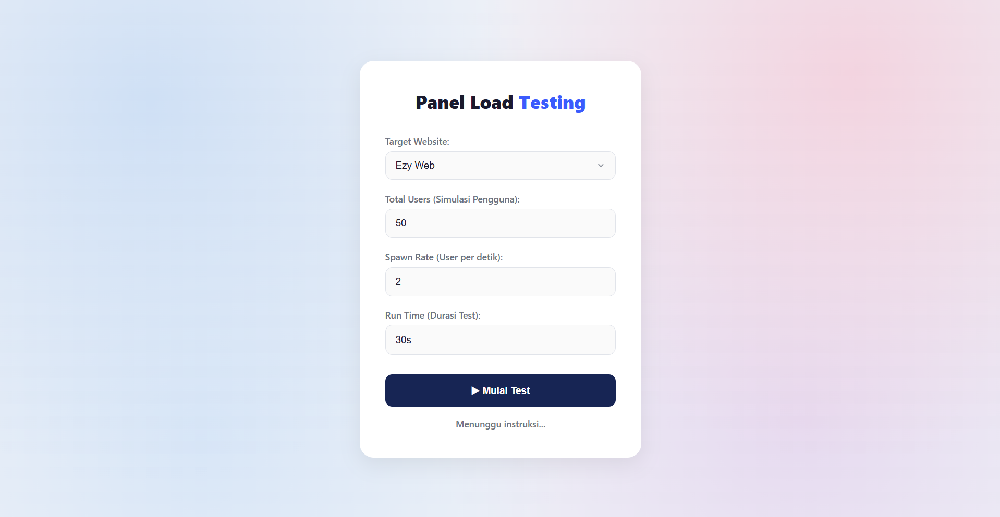
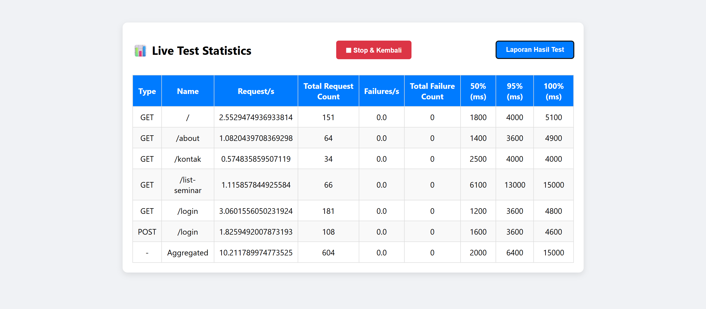

# RADNET Load Testing Interface

Interface internal untuk membantu tim RADNET menjalankan, mengatur, dan memantau load testing pada website atau layanan yang telah mendapatkan izin resmi.

Penggunaan alat ini hanya untuk pengujian yang sah dan terotorisasi. Dilarang menjalankan load test terhadap sistem, domain, atau API tanpa persetujuan dari pemilik layanan.

---

## Tujuan

Project ini menyediakan satu antarmuka terpusat untuk mempermudah eksekusi dan pemantauan load testing. Fitur utama yang disediakan meliputi:

* Pemilihan target pengujian (Ezy Web, Riwara, Lokakarya, dan Radnet).
* Konfigurasi parameter pengujian (Total Users, Spawn Rate, dan Run Time).
* Eksekusi pengujian secara kustom menggunakan skrip Locust.
* Pemantauan statistik performa (Response Time Percentiles) secara real-time.
* Penghentian proses pengujian secara instan dan aman.

---

## Teknologi

* Backend: Python (Flask)
* Frontend: HTML, CSS, JavaScript (Fetch API)
* Load-Testing Engine: Locust
* Inter-Process Communication: Python Subprocess

---

## Dokumentasi dan Demo

### Alur Antarmuka

### Demonstrasi Pengujian

---

## Struktur Project

├─ app.py                  
├─ requirements.txt        
├─ locustPrograms/         
│  ├── ezyWeb.py
│  ├── riwara.py
│  ├── lokakarya.py
│  └── radnet.py
├─ templates/              
│  ├── index.html          
│  └── dashboard.html      
└─ docs/                   
  ├── Demo-StressTest.mp4 
  ├── Index-Preview.png
  └── Dashboard-Preview.png

---

## Persiapan dan Penggunaan Lokal

### 1. Clone Repository
git clone https://github.com/rayyanft/StressTest-Radnet

### 2. Instal Dependensi
Pastikan Python 3.x telah terinstal, lalu jalankan:
pip install -r requirements.txt

### 3. Jalankan Aplikasi
python app.py

### 4. Akses Aplikasi
Buka browser dan akses alamat berikut:
http://localhost:5000

---

## Aturan Penggunaan Load Test

Sebelum menjalankan pengujian, pastikan:

1. Target pengujian telah memperoleh persetujuan tertulis dari pemilik sistem.
2. Waktu pelaksanaan pengujian telah dikomunikasikan kepada tim terkait.
3. Batas virtual user, durasi, dan spawn rate telah ditentukan secara aman.
4. Pengujian tidak menggunakan data produksi atau data pribadi tanpa izin.
5. Terdapat PIC yang siaga dan dapat dihubungi selama proses pengujian.
6. Pengujian segera dihentikan apabila terdeteksi gangguan pada sistem target.